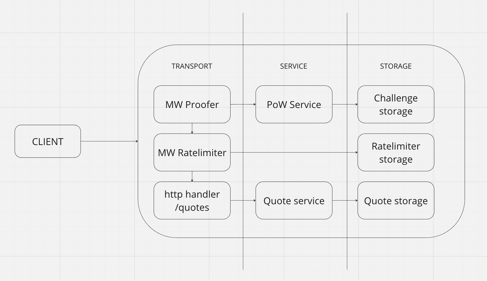

# Project architecture

## 1. Introduction

For this project I chose Go language, because it's simple, fast and has good concurrency support and developed
ecosystem.
For the architecture of the project I chose hexagonal-inspired n-tier architecture.
Let me explain why and what it means in practice.

## 2. Architecture

This architecture is based on the idea of separation of concerns and single responsibility principle.
There are 3 main layers (or tiers):

+ Application layer aka service layer - contains business logic of the application
+ Transport layer - contains logic of communication with external systems
+ Storage layer - contains logic of communication with storage systems

This layered leverages the fact that each layer has its own responsibility
and could be changed without affecting other layers.
Layers are kept agnostic to each other by using interfaces.
That allows to easily change implementation of some layer without affecting other layers, for example,
If I wanted to introduce gRPC server instead of HTTP server, I could easily do it by changing only transport layer.
Similarly, if I wanted to change storage from in-memory to Redis, I could do it by changing only storage layer.
This solid foundation provides a lot of extensibility and flexibility for the project.
This also provided decent testability for the project, because I could easily mock any layer and test it in isolation.

As any n-tier architecture, this architecture has downside — I had to write more code, but in this case, there were no
unnecessary proxing or forced layer additions, so I think that it was worth it.

## 3. Read more

- hexagonal architecture: [link](https://github.com/golang-standards/project-layout)
- project structure: [link](https://github.com/golang-standards/project-layout)